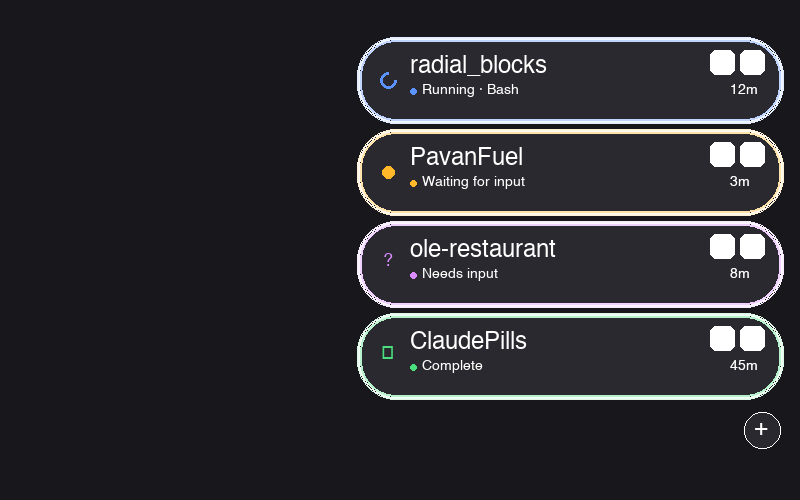

# ClaudePills

[](LICENSE)
[]()

A floating macOS dock that shows live status pills for your [Claude Code](https://docs.anthropic.com/en/docs/claude-code) sessions. See at a glance which sessions are running, waiting, or need input — without switching windows.

<p align="center">
  
</p>

## Features

### Live Session Pills
Each active Claude Code session gets a floating pill pinned to the edge of your screen. The pill shows real-time status:

| Indicator | State | Meaning |
|---|---|---|
| Spinner | **Running** | Claude is thinking, reading files, or running tools |
| Pulsing dot | **Waiting** | Session is idle, waiting for your next message |
| **?** | **Needs Input** | Claude is asking a question or waiting for tool permission |
| **checkmark** | **Complete** | Session finished |
| **x** | **Error** | Session hit an error |
| **-** | **Hidden** | Terminal window is minimized |

### Window Management
- **Click a pill** to instantly focus that session's terminal window
- **Hide/show** terminal windows directly from the pill — no Dock clutter
- **Drag pills** to reorder them
- **Click +** to open a new terminal window

### Organization
- **Rename** sessions (double-click a pill)
- **Color-code** pills to visually group related sessions (right-click > Color)
- **Auto-labels** with project folder name, numbered for duplicates

### Keyboard Shortcuts
- `Ctrl+Option+C` — cycle focus between sessions
- `Ctrl+Option+1` through `9` — jump directly to a session by position

### Menu Bar
- Session count badge in the menu bar
- Switch between **iTerm2** and **Terminal.app** (or let it auto-detect)
- Dock the panel on the **left or right** edge
- **Auto-Hide** the panel when no sessions are active
- **Launch at Login** to start automatically
- **Copy Debug Info** (Cmd+D) for bug reports

### Notifications
Desktop notifications when a session completes or errors — so you can work in another app and know when Claude is done.

## Requirements

- macOS 14 (Sonoma) or later
- Swift 5.9+ (comes with Xcode or Xcode Command Line Tools)
- Node.js 18+ (`brew install node` if you don't have it)
- [Claude Code](https://docs.anthropic.com/en/docs/claude-code) CLI

## Quick Start

```bash
git clone https://github.com/pua2/ClaudePills.git
cd ClaudePills
./setup.sh
```

The setup script does everything:
1. Checks prerequisites (Swift, Node.js)
2. Builds the native macOS app
3. Installs server dependencies
4. Installs Claude Code hooks in `~/.claude/settings.json`
5. Creates `ClaudePills.app` in `~/Applications` with a proper app icon
6. Starts the server and app via LaunchAgents

**After setup, grant Accessibility permission:**
System Settings > Privacy & Security > Accessibility > toggle ON **ClaudePills**

Then start a Claude Code session in your terminal — a pill will appear on the right edge of your screen.

## How It Works

ClaudePills has three parts that communicate entirely on localhost:

```
Claude Code ──hook──> Server (port 3737) ──WebSocket──> App (floating pills)
```

1. **Hook** (`hooks/notify.sh`) — Claude Code calls this on every tool use and stop event, sending session state to the local server via HTTP POST
2. **Server** (`server/server.js`) — lightweight Node.js process that receives hook events, tracks session state, and broadcasts updates over WebSocket
3. **App** (`ClaudePills/`) — native macOS Swift app that connects to the WebSocket, renders floating pills, and manages terminal windows via AppleScript

All communication stays on `127.0.0.1:3737`. Nothing leaves your machine.

## Usage Reference

| Action | How |
|---|---|
| Focus a session | Click its pill |
| Rename | Double-click the pill |
| Set color | Right-click > Color |
| Hide/show terminal | Hover pill, click `-` or `[]` |
| Reorder | Drag pills up/down |
| New terminal | Click `+` at the bottom |
| Cycle sessions | `Ctrl+Option+C` |
| Jump to session N | `Ctrl+Option+1` through `9` |
| Move panel | Drag the panel up/down along the edge |
| Switch screen edge | Menu bar icon > Position > Left/Right |
| Copy debug info | Menu bar icon > Copy Debug Info (Cmd+D) |

## Troubleshooting

**Pills don't appear when I start Claude Code**
- Check the server is running: `curl -s http://localhost:3737/sessions`
- If nothing returns, start it: `launchctl load ~/Library/LaunchAgents/com.claudepills.server.plist`
- Check hooks are installed: `cat ~/.claude/settings.json | grep notify`

**"ClaudePills would like to control iTerm2/Terminal" prompt**
- Click OK — this is needed to focus and hide/show terminal windows

**App doesn't appear in menu bar**
- Grant Accessibility: System Settings > Privacy & Security > Accessibility > ClaudePills ON
- Restart the app: `open ~/Applications/ClaudePills.app`

**Pills show wrong state**
- Click the menu bar icon > Refresh (Cmd+R)
- Use Copy Debug Info (Cmd+D) and share the output for help

## Uninstall

```bash
# Stop services
launchctl unload ~/Library/LaunchAgents/com.claudepills.server.plist
launchctl unload ~/Library/LaunchAgents/com.claudepills.app.plist

# Remove LaunchAgents
rm ~/Library/LaunchAgents/com.claudepills.*.plist

# Remove app
rm -rf ~/Applications/ClaudePills.app

# Remove hooks from Claude Code settings (edit manually)
# Open ~/.claude/settings.json and remove the notify.sh hook entries

# Remove logs
rm -rf ~/.claudepills
```

## Architecture

```
ClaudePills/
├── ClaudePills/          # Swift Package — the native macOS app
│   ├── Package.swift
│   └── Sources/ClaudePills/
│       ├── main.swift            # App entry point
│       ├── AppDelegate.swift     # Menu bar, hotkeys, panel setup
│       ├── SessionManager.swift  # WebSocket client, session state
│       ├── PillView.swift        # Individual pill UI (SwiftUI)
│       ├── DockView.swift        # Pill container + drag/drop
│       ├── FloatingPanel.swift   # Always-on-top borderless window
│       ├── TerminalBridge.swift  # AppleScript terminal control
│       ├── TerminalType.swift    # iTerm2/Terminal.app abstraction
│       ├── AppIcon.swift         # Programmatic icon generation
│       ├── HelpView.swift        # Help window
│       ├── Session.swift         # Data models
│       └── AccessibilityManager.swift
├── server/               # Node.js WebSocket relay server
│   ├── server.js
│   └── package.json
├── hooks/                # Claude Code hook scripts
│   ├── notify.sh         # Sends events to server
│   └── install.sh        # Installs hooks into Claude settings
├── scripts/
│   └── install-launchagent.sh  # Creates .app bundle + LaunchAgents
├── demo/                 # Web-based interactive mockup (dev only)
├── setup.sh              # One-command setup
└── .github/workflows/ci.yml
```

## License

[MIT](LICENSE)
